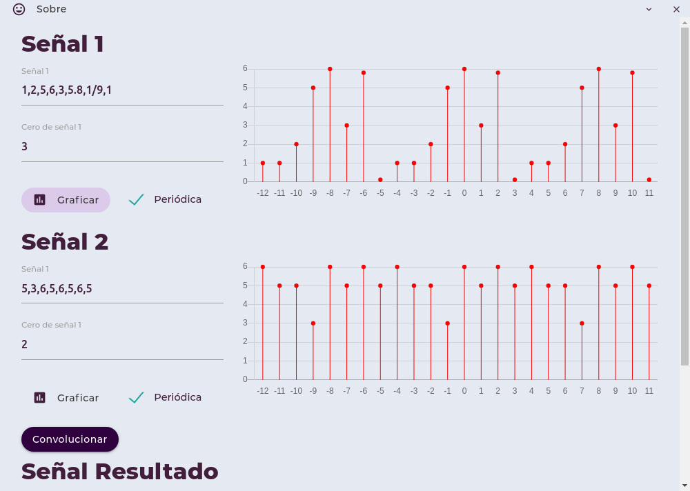
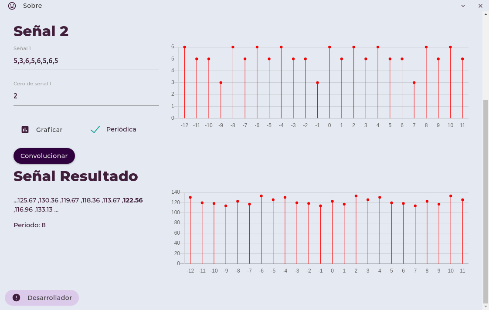
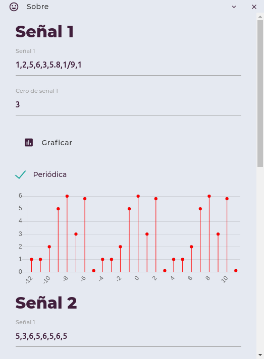

# Señales
## Práctica 02 | Convolución de señales discretas.
## Indice
- [Descripción](#Descripción)
- [Capturas](#Capturas)
- [Estrutura del proyecto](#Estrutura-del-proyecto)
- [Test](#Test)
- [Edición](#Edición)
## Descripción
Programa que, dadas 2 señales discretas (ya sean periódicas, o no), permite calcular la convolución de dichas señales, además de obtener su gráfica y mostrarla.
- Recibe 2 señales discretas.
- Pueden ser periódicas.
- Admite fracciones y números flotantes.

Se realizó completamente en [Nodejs](https://nodejs.org/es/) y [Electron](https://www.electronjs.org/) usando JavaScript, CSS, HTML y, para la parte responsiva y el diseño, se utilizó el Framework [MaterializeCSS](https://materializecss.com/).
## Capturas
### Interfaz principal:



### Créditos

### Aplicación Responsiva

## Requisitos
- Git (recomendado)
- Nodejs (versión ^13.x.x)
- npm (Viene con Nodejs)
## Uso
1. Clona este repositorio, ya sea descargándolo, o clonandolo con `git`:
```bash
git clone https://github.com/JoelHernandez343/ConvolucionSenalesDiscretas.git
```
2. En la terminal, abre el repo:
```bash
cd ConvolucionSenalesDiscretas
```
3. Instala los paquetes locales necesarios:
```bash
npm i
```
4. Ejecuta el servidor `Electron` y el compilador de `Pug` con:
```bash
npm start
```
## Estrutura del proyecto
```
src // Código
├── app.js  // Aplicación Electron JS
├── css     // Estilos
│   ├── icons.css
│   ├── main.css
│   ├── materialize.min.css // Estilos de Materialize CSS
│   └── montserrat-font.css
├── fonts   // Fuentes usadas
├── js      // Lógica principal
│   ├── convolucion
│   │   ├── convolucionFinita.js
│   │   └── convolucionPeriodica.js
│   ├── graph // Necesario para graficar, librería externa
│   │   └── graph.js
│   ├── main.js
│   ├── materialize.min.js
│   └── rename
│       └── rename.js
├── pug     // Editar este, automáticamente Pug actualizará las vistas
│   └── index.pug
└── views   // Vistas renderizadas por Pug
    └── index.html
```
## Test
En `test/` se encuentran algunas señales de prueba. 

## Edición
> `Electron` cuenta con HotReload, cada cambio que se realice en los archivos refrescará la aplicación.

**Importante** `Pug` es un preprocesador para HTML, editar `index.pug` si es que se quiere editar la estructura de la aplicación!

`Pug` tiene una sintaxis más simple que HTML, es muy importante la tabulación, revisar este [artículo](https://medium.com/laboratoria-how-to/conoce-todo-sobre-pug-1ba98496191a) o la [documentación oficial](https://pugjs.org/api/getting-started.html).

Al ejecutar `npm start`, aparte del servidor de `Electron` se ejecuta el compilador de `Pug`, solo es necesario guardar el archivo `index.pug` y `Pug` detectará automáticamente los cambios y compilará `index.html` y `Electron` refrescará la aplicación.